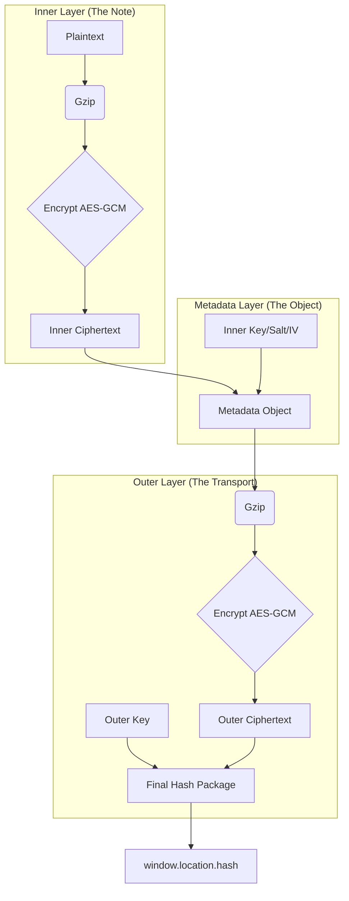

# Obscura: A Technical Thesis on Stateless End-to-End Encrypted Persistence

## Abstract
Obscura is a decentralized, serverless application designed for secure text persistence. Unlike traditional web applications that rely on persistent database state or local browser storage, Obscura implements a "Stateless URL-as-Database" paradigm. By utilizing a multi-layered AES-GCM encryption pipeline and conditional third-party offloading, Obscura achieves total privacy and high-entropy security without a proprietary backend.

---

## 1. The Core Cryptographic Pipeline

The system employs a multi-stage data transformation process to ensure both confidentiality and efficient transport.

### 1.1 Compression Phase
Every data packet begins its lifecycle with **Gzip compression** (via the browser's `CompressionStream` API). This serves two purposes:
1.  **Entropy Reduction**: Standardizing the input data before encryption.
2.  **Size Optimization**: Reducing the footprint to maximize the amount of data that can be stored natively within the 2048-character limit typical of browser URL fragments.

### 1.2 Inner Encryption Layer (Note Security)
The compressed binary data is encrypted using **AES-GCM (256-bit)**. The key used here depends on the note's security mode:
-   **Open Mode**: A cryptographically secure random key is generated.
-   **Protected Mode**: A key is derived from a user-provided password using **PBKDF2** (Password-Based Key Derivation Function 2) with **100,000 iterations** of **SHA-256** and a unique 16-byte salt.

### 1.3 Conditional Storage Offloading
To handle payloads exceeding the constraints of a URL, the system performs a capacity check:
-   **Inline Storage (< 2KB)**: The ciphertext is stored directly within the metadata object.
-   **Gist Storage (> 2KB)**: The ciphertext is uploaded to a GitHub Gist (via a global or user-specific token). In this scenario, only the **Gist ID** is retained in the metadata.

---

## 2. The "Russian Doll" Packaging Model

Obscura uses a nested encryption strategy (V2) to separate note content from transport metadata.

### 2.1 Metadata Layer (Layer 1)
The application constructs an `INoteAppSettings` object containing:
-   `d`: Inner Ciphertext or Gist ID.
-   `iv`: Initialization Vector for the Inner Ciphertext.
-   `s`: Salt (if protected).
-   `k_inner`: The Inner Key (only if in "Open" mode).

### 2.2 Outer Encryption Layer (Layer 2)
The entire Metadata object is stringified, compressed again, and encrypted with a **randomly generated Outer Key**. This key is the only one that exists in the "clear" (base64 encoded) at the top level of the URL hash.

---

## 3. State Analysis: Why LocalStorage is Empty

A primary architectural goal of Obscura is **Zero-Persistence**. The application does not utilize `LocalStorage`, `IndexedDB`, or cookies for state recovery.

-   **Redux as Registry**: Redux is used as a temporary, in-memory registry to manage the active session state.
-   **URL as Source of Truth**: Since the state is entirely encapsulated in the URL fragment, refreshing the page or moving to another machine requires no "login" or "sync" mechanism. The URL *is* the record.
-   **Security Implication**: By avoiding LocalStorage, the application ensures that no cryptographic material remains on the machine after the tab is closed, mitigating risk against physical access attacks or cross-site scripting (XSS) targeting persistent storage.

---

## 4. Key Management Table

| Phase | Responsibility | Derivation / Generation | Transmission |
| :--- | :--- | :--- | :--- |
| **Inner Key (Open)** | Note Privacy | `crypto.subtle.generateKey` | Encrypted in Outer Layer |
| **Inner Key (Protected)** | User Identity | PBKDF2 (100k iters) | **Never Transmitted** |
| **Outer Key** | Transport Wrapper | `crypto.subtle.generateKey` | Plaintext in URL Hash (Base64) |

---

## 5. Conclusion
The Obscura architecture provides a high-security, low-friction environment for ephemeral or permanent notes. By separating the Note Key from the Transport Key, it allows metadata to be easily parsed by the browser while keeping the content itself restricted to either the owner of the link (Open) or the owner of the password (Protected).
